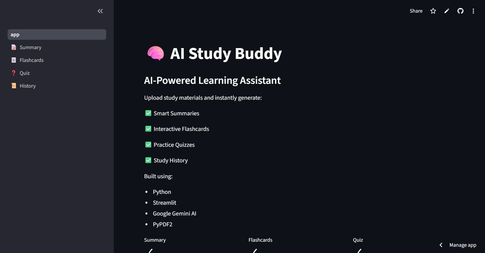
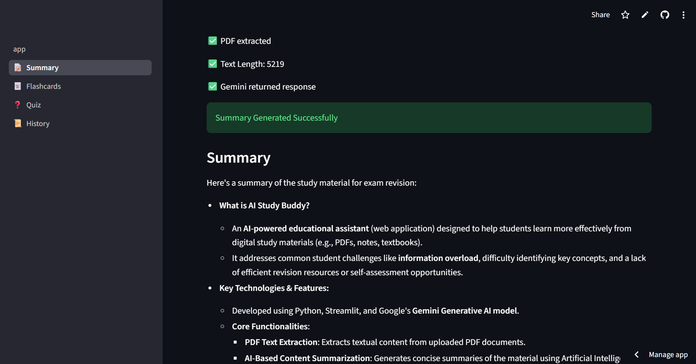
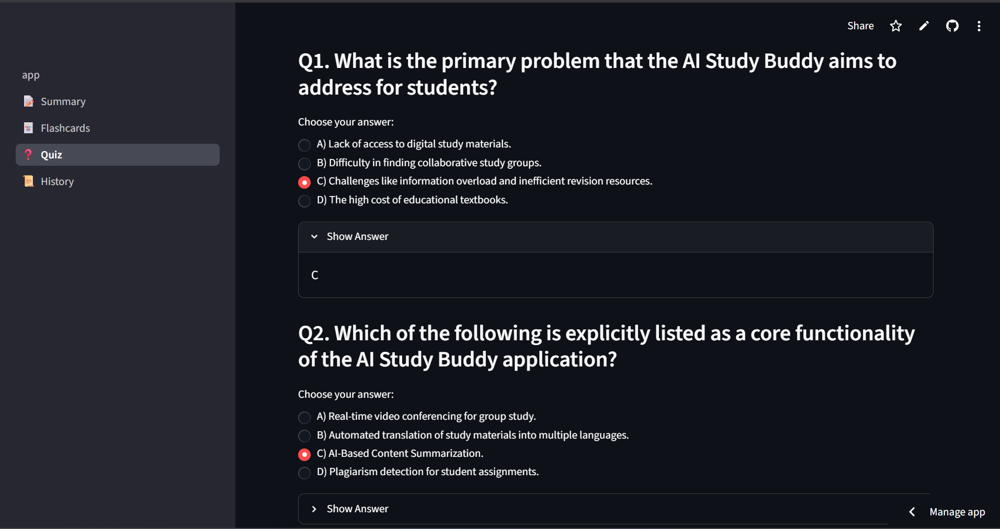
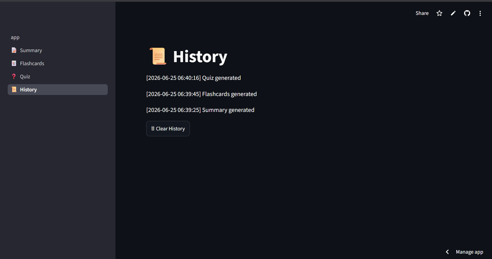

# 🧠 AI Study Buddy

AI Study Buddy is an intelligent learning assistant that transforms PDF study material into concise summaries, revision flashcards, and practice quizzes using Google's Gemini AI.

The project is designed to help students reduce study time, improve retention, and prepare efficiently for examinations through AI-powered content generation.

---
## 📸 Application Screenshots

### Home Page



### Summary Generation



### Flashcard Generation


### Quiz Generation



### History Tracking



## 🚀 Features

### 📄 PDF Processing

* Upload PDF study material directly through the web interface
* Extract and process text automatically using PyPDF2
* Supports academic notes, lecture materials, and study guides

### 📝 AI-Powered Summaries

* Generates concise and exam-focused summaries
* Highlights key concepts, definitions, and important points
* Removes redundant information for faster revision

### 🃏 Flashcard Generation

* Automatically creates revision flashcards
* Question-and-answer format for active recall learning
* Designed to improve memory retention

### ❓ Quiz Generation

* Generates multiple-choice questions from study material
* Includes answer keys for self-assessment
* Helps evaluate conceptual understanding

### 📜 Study History

* Maintains a history of generated content
* Allows users to track study activities
* Supports clearing history when required

### ⬇ Export Functionality

* Download generated summaries
* Download flashcards
* Download quizzes for offline study

### 🎨 User-Friendly Interface

* Multi-page Streamlit dashboard
* Simple and responsive UI
* Session state management for seamless navigation

---

## 🏗 System Architecture

PDF Upload
↓
Text Extraction (PyPDF2)
↓
Content Processing
↓
Google Gemini AI
↓
├── Summary Generation
├── Flashcard Generation
└── Quiz Generation
↓
Display & Download

---

## 🛠 Technology Stack

| Category               | Technologies     |
| ---------------------- | ---------------- |
| Programming Language   | Python           |
| Frontend/UI            | Streamlit        |
| Generative AI          | Google Gemini AI |
| PDF Processing         | PyPDF2           |
| Environment Management | python-dotenv    |
| Version Control        | Git & GitHub     |

---

## 📂 Project Structure

```text
AI-Study-Buddy/

├── app.py
├── gemini_helper.py
├── summarizer.py
├── flashcard_generator.py
├── quiz_generator.py
├── pdf_reader.py
├── history.py
├── requirements.txt
├── .gitignore

├── pages/
│   ├── 1_📝_Summary.py
│   ├── 2_🃏_Flashcards.py
│   ├── 3_❓_Quiz.py
│   └── 4_📜_History.py

└── README.md
```

---

## ⚙️ Installation

### 1. Clone the Repository

```bash
git clone https://github.com/MuraliKrishna1409/AI-Study-Buddy.git
cd AI-Study-Buddy
```

### 2. Install Dependencies

```bash
pip install -r requirements.txt
```

### 3. Configure Gemini API

Create a `.env` file in the project root:

```env
GEMINI_API_KEY=YOUR_API_KEY
```

### 4. Launch Application

```bash
streamlit run app.py
```

---

## 📖 Usage

1. Launch the application.
2. Navigate to the Summary page.
3. Upload a PDF document.
4. Generate an AI-powered summary.
5. Create flashcards from the generated content.
6. Generate practice quizzes.
7. Download outputs for offline revision.

---

## 🎯 Learning Outcomes

This project demonstrates practical experience in:

* Generative AI integration
* Prompt engineering
* Python application development
* Streamlit dashboard development
* PDF document processing
* Session state management
* API integration
* Software project structuring
* Git and GitHub workflows

---

## 🔮 Future Enhancements

* DOCX and PPT support
* Difficulty-based quiz generation
* User authentication
* Cloud database integration
* Personalized study recommendations
* PDF export functionality
* Performance analytics dashboard

---

## 👨‍💻 Author

Murali Krishna

Computer Science Engineering Student

Passionate about Artificial Intelligence, Cloud Computing, and Software Development.

---

## ⭐ Project Status

Version: 1.0

Status: Completed and Functional

Current Features:

* PDF Upload
* AI Summary Generation
* Flashcard Generation
* Quiz Generation
* Study History
* Download Support
* Multi-Page Dashboard
